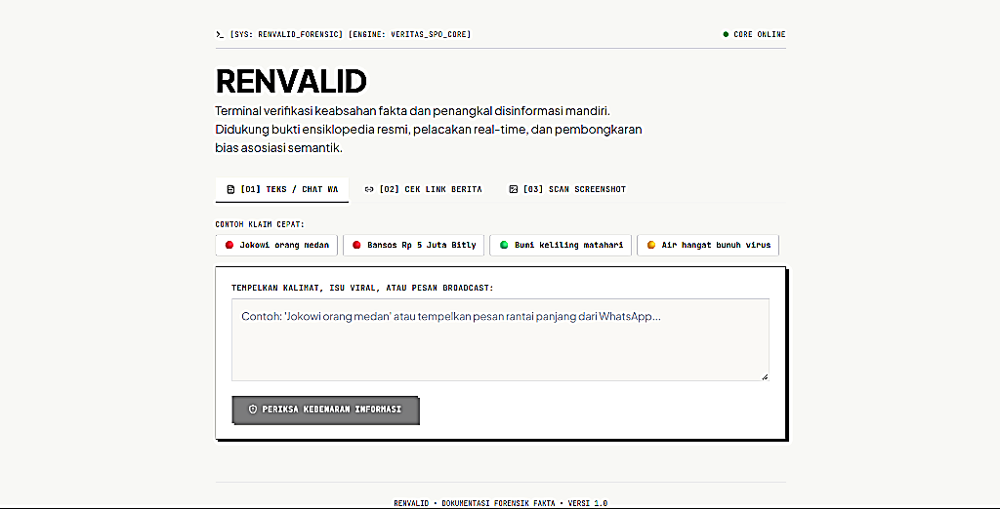

# 🛡️ RENVALID — Forensic Fact-Checking & Anti-Disinformation Terminal

[](LICENSE)
[](https://fastapi.tiangolo.com)
[](https://vitejs.dev)
[](https://tailwindcss.com)

<p align="center">
  
</p>

**RENVALID** adalah platform terminal pemeriksa keabsahan fakta dan penangkal disinformasi independen. Dirancang untuk memverifikasi kebenaran klaim, berita viral, pesan berantai WhatsApp, dan dokumen tangkapan layar secara instan dengan bukti multi-sumber resmi (Wikipedia Indonesia API, DuckDuckGo Web Search, dan media terverifikasi Dewan Pers).

---

## 🎯 Mengapa RENVALID? (Problem Statement)

Banyak pendeteksi hoaks konvensional sering mengalami **"Entity Association Trap" (Jebakan Asosiasi Kata)**:
> **Contoh Kasus**: Ketika pengguna menguji klaim *"Jokowi orang medan"*, mesin pencari naif menemukan banyak berita kunjungan kerja Jokowi ke Medan atau menantunya (Bobby Nasution) di Medan. Akibatnya, AI amatir menyimpulkan berita itu relevan atau bahkan valid.

**Solusi RENVALID**:  
Sistem menerapkan **Semantic Predicate Alignment (SPO)**. Sistem membedakan secara tegas antara predikat **"asal-usul / tempat lahir"** dengan **"kegiatan dinas / afiliasi keluarga"**. Dengan membandingkan langsung ke basis biografi resmi, RENVALID memastikan klaim tersebut divonis **SALAH / HOAKS**, disertai klarifikasi bahwa Jokowi lahir dan berasal dari Surakarta (Solo), Jawa Tengah.

---

## ✨ Fitur Utama

1. **Anti-Conflation Semantic Verifier**:
   - Membedakan relasi semantik secara akurat (asal-usul vs kegiatan/kunjungan).
   - Klasifikasi 4-Level: 🔴 `TERBUKTI HOAKS / SALAH`, 🟢 `TERVERIFIKASI FAKTA`, 🟡 `MERAGUKAN / KURANG KONTEKS`, ⚪ `OPINI SUBJEKTIF`.
2. **3 Modus Input Terpadu**:
   - 📝 **[01] Teks & Chat WA**: Tempel pesan broadcast panjang atau klaim langsung, lengkap dengan tombol contoh kasus cepat.
   - 🔗 **[02] Cek Link Berita**: Ekstraksi artikel berita otomatis (Web Scraper) untuk memeriksa apakah isi atau judulnya clickbait/menyesatkan.
   - 🖼️ **[03] Scan Screenshot (Multimodal Vision)**: Drag-and-drop tangkapan layar chat WhatsApp, poster bansos, atau meme viral untuk diekstrak narasinya secara otomatis.
3. **1-Click WhatsApp Debunker (Killer Feature)**:
   - Draf pesan klarifikasi sopan berformat tebal khas WhatsApp, siap salin satu-klik untuk meluruskan kabar bohong di grup obrolan.
4. **Desain Anti-AI-Slop (Swiss Forensic Terminal)**:
   - Bebas dari gradien ungu murahan dan generic SaaS cards.
   - Dilengkapi stempel fisik rubber-stamp (*tilt -1.2°*), bayangan taktis tegas (`4px 4px 0px`), dan tipografi presisi (`Plus Jakarta Sans` + `JetBrains Mono`).

---

## 🏗️ Arsitektur & Alur Kerja Sistem

```
Input Pengguna (Teks / URL Berita / Screenshot)
   │
   ├── [Modus Teks] ───────────────┐
   ├── [Modus URL]  ──> Scraper ──>┼──> Claim Extractor & SPO Identifier
   └── [Modus Img]  ──> Vision  ──>┘            │
                                                ▼
                                    Multi-Source Live Grounding
                                 (Wikipedia ID + DuckDuckGo Web)
                                                │
                                                ▼
                                     Strict Predicate Verifier
                                    (Anti-Conflation Reasoning)
                                                │
                                                ▼
                                    Laporan Forensik Fakta
                                 ├── Stempel Status Fisik
                                 ├── Skor Keyakinan (%)
                                 ├── Kartu Bukti & Link Asli
                                 └── Draf Bantahan WhatsApp
```

---

## 📁 Struktur Direktori

```
renvalid/
├── backend/                  # Layanan Backend FastAPI
│   ├── main.py               # REST API Endpoint (/api/verify, /api/scrape-url, /api/scan-image)
│   ├── config.py             # Konfigurasi & integrasi API Key
│   ├── core/
│   │   └── verifier.py       # Engine penalaran & pembongkar jebakan semantik
│   ├── retrieval/
│   │   ├── wikipedia.py      # Basis pengetahuan resmi Wikipedia Indonesia
│   │   ├── web_search.py     # Live Web Search DuckDuckGo
│   │   └── url_scraper.py    # Ekstraktor artikel berita web (BeautifulSoup)
│   └── multimodal/
│       └── vision.py         # Ekstraktor teks tangkapan layar/flyer
│
├── frontend/                 # Antarmuka Pengguna React + Vite + Tailwind CSS
│   ├── src/
│   │   ├── App.jsx           # Komponen UI utama (Swiss Forensic Layout)
│   │   ├── index.css         # Styling anti-slop, stempel fisik, & tactile shadow
│   │   └── main.jsx
│   ├── index.html            # Tipografi Plus Jakarta Sans & JetBrains Mono
│   ├── package.json
│   └── vite.config.js
│
├── tests/                    # Pengujian Otomatis
│   └── test_backend.py       # Unit & integration test
│
├── .gitignore                # Proteksi file rahasia (.env, node_modules)
├── .env                      # API Key & Model Configuration
├── requirements.txt          # Dependensi Python backend
├── PRD.md                    # Product Requirements Document
├── DESIGN_PRD.md             # Blueprint Desain UI/UX
└── README.md                 # Dokumentasi proyek
```

---

## 🚀 Panduan Instalasi & Menjalankan

### Prasyarat:
- Python 3.10+
- Node.js 18+ & npm

### 1. Clone Repositori
```bash
git clone https://github.com/Renzitaroo/renvalid.git
cd renvalid
```

### 2. Konfigurasi Environment Backend
Buat file `.env` di root folder:
```env
GEMINI_API_KEY=your_api_key_here
GEMINI_MODEL=gemini-3.5-flash
```

### 3. Setup & Jalankan Backend
```bash
# Install dependensi Python
pip install -r requirements.txt

# Jalankan server FastAPI
python -m uvicorn backend.main:app --host 127.0.0.1 --port 8000 --reload
```
API Documentation (Swagger UI): `http://127.0.0.1:8000/docs`

### 4. Setup & Jalankan Frontend
Buka terminal baru:
```bash
cd frontend

# Install dependensi Node
npm install

# Jalankan server frontend Vite
npm run dev
```
Buka di browser: **`http://127.0.0.1:5180`**

---

## 🧪 Pengujian Otomatis

Jalankan test suite untuk memvalidasi fungsi scraping, Wikipedia retrieval, dan penanganan predikat semantik:
```bash
python tests/test_backend.py
```

---

## 📡 Dokumentasi Endpoint REST API

| Method | Endpoint | Deskripsi | Payload |
| :--- | :--- | :--- | :--- |
| `GET` | `/api/health` | Cek status kesehatan backend | None |
| `POST` | `/api/verify` | Memverifikasi klaim informasi | `{"claim": "string"}` |
| `POST` | `/api/scrape-url` | Mengekstrak judul & isi artikel web | `{"url": "string"}` |
| `POST` | `/api/scan-image` | Memindai teks klaim dari gambar | `multipart/form-data (file)` |

---

## 📄 Lisensi
Didistribusikan di bawah Lisensi MIT. Bebas digunakan dan dikembangkan untuk kepentingan publik dan edukasi literasi digital.
